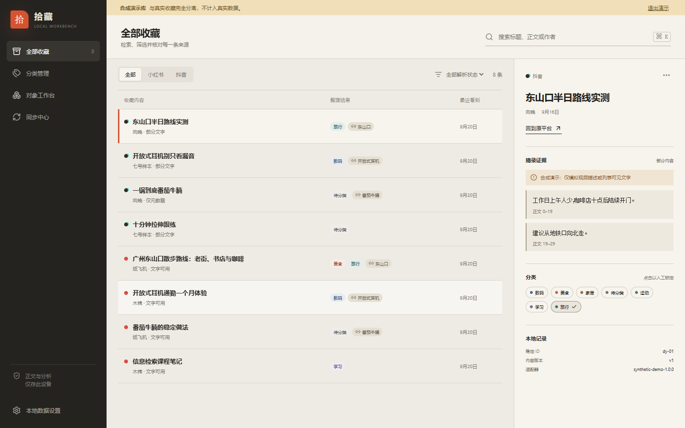
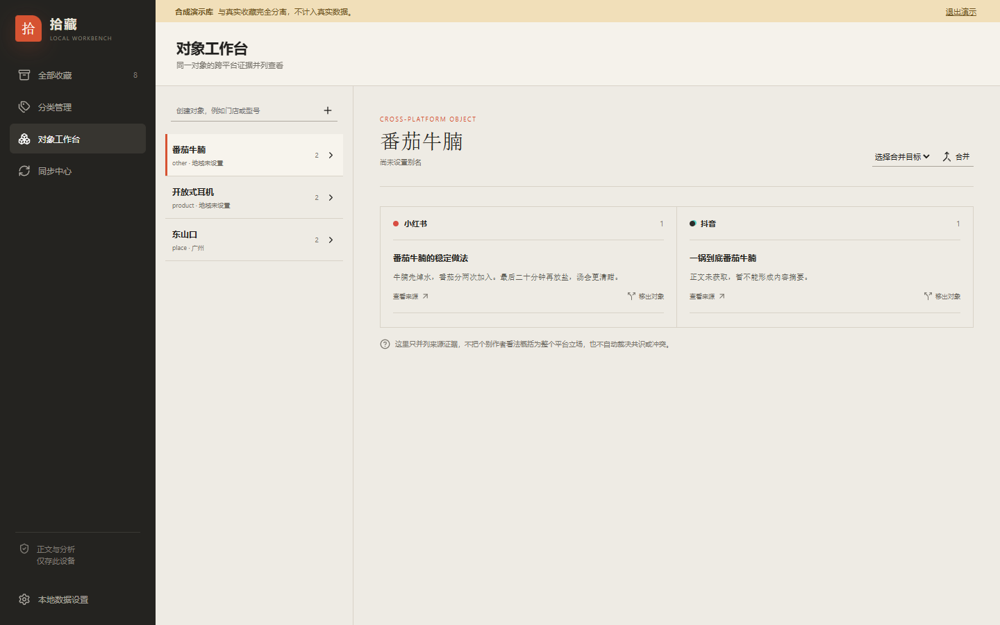

# 拾藏 · 本地跨平台收藏工作台

一个本地优先的收藏工作台，提供打开即用的公开网页和可选的 Manifest V3 浏览器扩展。网页可直接保存、批量导入、搜索、分类、关联具体对象并做基于原文的摘录对照；扩展用于用户主动读取平台网页当前展示的收藏。

> 当前版本是可运行的内测工程，不把平台接入状态包装成“已全量打通”。两个网页适配器尚未完成真实账号全历史验证，因此真实扫描只新增或更新；只有测试中的“可信适配器完整快照”才会启用缺失项对账。详见 [平台能力矩阵](docs/feasibility.md)。

## 网页直接使用

访问 **[拾藏网页版](https://lccs02.github.io/cs-xhs-dy/)**，无需注册，也无需安装扩展。收藏数据、分类和摘录保存在当前浏览器的 IndexedDB 中。

网页版支持单条添加、按行批量粘贴、自动分类、摘录、对象对照，以及与扩展版兼容的 JSON 备份。受浏览器同源策略限制，普通网页不能直接读取小红书或抖音的登录态收藏；需要从平台已展示页面读取时，再选择下方扩展版。详见 [网页版使用与边界](docs/web-app.md)。

## 可选：安装浏览器扩展

已经生成两套 Chrome/Edge MV3 包：

- 基础目录：`.output/chrome-mv3-basic`
- 基础 ZIP：`.output/shoucang-workbench-0.1.0-basic-chrome.zip`
- 增强目录：`.output/chrome-mv3-enhanced-0.1.0`
- 增强 ZIP：`.output/shoucang-workbench-0.1.0-enhanced-chrome.zip`

当前产物 SHA-256：

```text
基础包  92D1DB67170A558ADB4929295C344DCAC8A2B549BEA0F5EF0BECA2707C5A1C19
增强包  99E0DCF607ACC6D3F93DA35CF2ABF3CEF9FE0804D4DCB84FECB897D3705D9447
```

ZIP 不能直接加载。先解压到固定目录，然后：

1. 打开 `chrome://extensions` 或 `edge://extensions`。
2. 开启“开发者模式”。
3. 点击“加载已解压的扩展程序”，选择解压后的目录。
4. 固定“拾藏”到工具栏。
5. 在官方平台正常登录并进入收藏页，点击工具栏中的“拾藏”，再主动开始同步。

升级时不要先卸载。把新版覆盖到同一个固定目录，再在扩展管理页点“重新加载”；换目录或卸载可能改变扩展 origin，导致本地 IndexedDB 看起来丢失。更新前先从“本地数据设置”导出备份。

## 开发与验证

要求 Node `>=22 <25`，本仓库实际使用 Node 24.14.0 与 npm 11.9.0。

```bash
npm install
npm run dev
npm run web:dev
npm run web:build
npm run lint
npm run typecheck
npm test
npm run build
npm run zip
npm run test:e2e
npm run audit:package
```

增强包：

```bash
npm run prepare:model
npm run verify:model
npm run build:enhanced
npm run zip:enhanced
```

`prepare:model` 只供开发者显式运行；用户导入收藏时不会联网下载模型。模型、WASM、字体与脚本均随增强包本地交付。

## 已实现

- WXT + React + TypeScript 的 MV3 扩展，工具栏弹窗与全屏工作台。
- `activeTab + scripting + storage` 最小权限；无 `<all_urls>`、cookies、history、debugger、遥测或云服务。
- 小红书、抖音独立适配器；稳定内容 ID 去重、保守账号识别、动态列表分批扫描、暂停/继续/取消。
- IndexedDB/Dexie 数据模型、任务检查点、Service Worker 中断状态、安全对账、异常下降保护和派生数据清理。
- 收藏分页、搜索、平台/解析状态筛选、分类管理、人工锁定、对象合并/拆分与跨平台证据并列。
- 中文基础规则分类、字符 n-gram 搜索特征、摘录式摘要；只有标题或部分描述时明确提示边界。
- 真实库与合成演示库完全分离；本地 JSON 备份、事务恢复、删除全部数据。
- 可选 BGE 中文本地向量 Worker：固定模型版本、远程模型禁用、批处理、取消、按输入哈希缓存与失败回退。

## 合成数据界面





## 关键边界

- 扩展不读取、导出或保存原始 Cookie，不处理密码/验证码，不绕过风控。
- 当前适配器仅读取正常页面已展示的链接与卡片文字，不调用未经确认的私有 API，也不声称网页等于 App 全量收藏。
- “没有新卡片”不是可靠结束依据；未验证适配器不会据此移除本地记录。
- 首版不做 OCR、视频下载、口播转写、画面理解、评论采集或生成式总结。
- IndexedDB 不是加密保险箱。浏览器或操作系统被他人控制时，本地数据仍可能被读取。

## 文档

- [架构与状态机](docs/architecture.md)
- [平台能力矩阵与真实验证状态](docs/feasibility.md)
- [数据模型](docs/data-model.md)
- [隐私与安全边界](docs/privacy.md)
- [测试与验收记录](docs/testing.md)
- [本地模型与许可证](docs/local-model.md)
- [中文内测安装、更新与备份指南](docs/beta-guide.md)
- [网页版使用与边界](docs/web-app.md)
